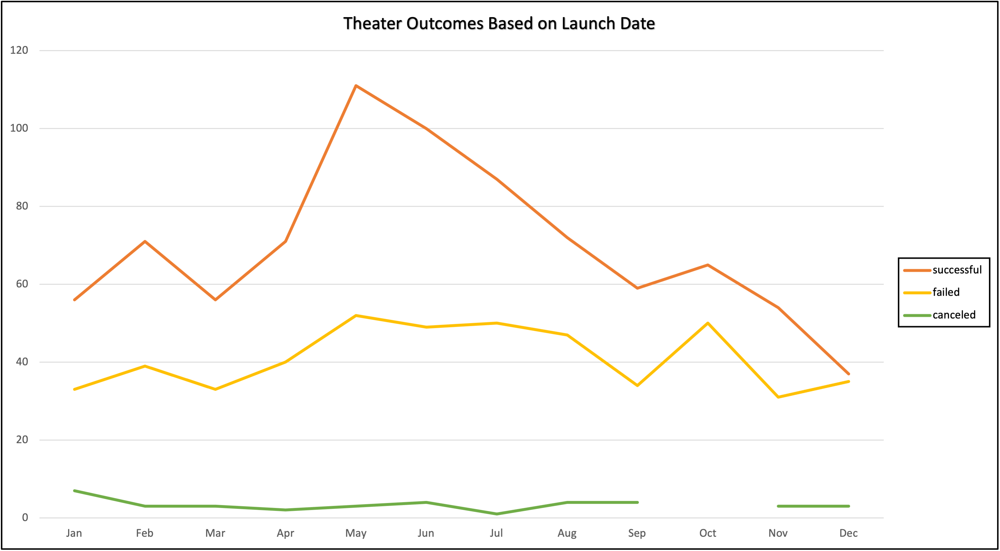
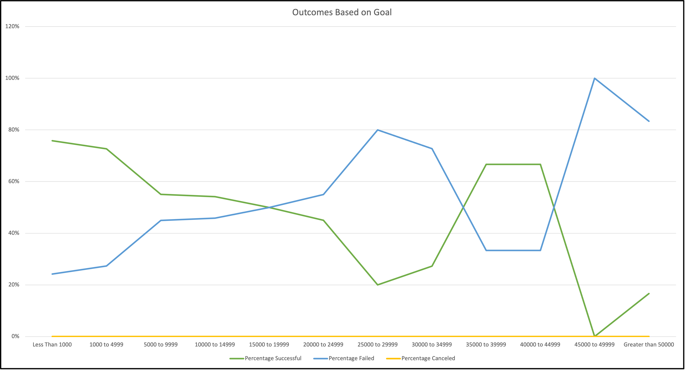

# Kickstarting with Excel

## Overview of Project  
    Louise's play, Fever was close to its fundraising goal and now Louise wants to identify the relationship between launch dates and funding goals for Kickstarters with the Category: Theater and Subcategory: Plays.

### Purpose 
    Identify outcomes of campaigns in relation to their launch dates and funding goals through analysis and visual charts.

## Analysis and Challenges
    The analysis was implemented by looking at the total count outcomes of successful, failed, and canceled campaigns in the Category: Theater by launch date and followed by an analysis of the percentage of successful, failed, canceled Subcategory: plays and their relationship to their fundraising goals in increments of 5000.

### Analysis of Outcomes Based on Launch Date
   From a pivot table created with Parent Category: Theater filter and Year filter, a line graph was created titled: Theater Outcomes Based on Launch Date. To identify the relationship between the number of successful, failed, and canceled Theater campaigns and their launch dates.  
   
   The analysis shows: 
   1. Throughout the years 2009 to 2017 at any given month of the year less than 10 theater campaigns were canceled. 
   2.  The month of May had the highest count of successful campaigns from 2009-2017.
   3.  The years 2010-2013 had a 100% Theater campaign success rate. 
   4.  By the year 2017, the number of Theater campaigns launched had signifcantly decreased. 

### Analysis of Outcomes Based on Goals
  A line graph was created to determine the relationship between the campaign goal amount and the percentage of successful, failed, and canceled plays. 
  
  The analysis shows:
  1. That zero percent of plays campaigns were cancelled.
  2. Campaigns that had a goal less than $1,000 had the highest success rate.
  3. There is a negative correlation between the goal amount and the success rate, for campaigns between >1000 and >=39999.
 
### Challenges and Difficulties Encountered
  A challenge encountered throughout the analysis is that the trends weren't entirely consistent, making it difficult to draw defintive conclusions. For example, while the percentage of successful plays campaigns seems to decrease as the goal increases, the trend changes and increases significantly at $35,0000.

## Results

The analysis of Outcomes Based on Launch Dtae shows that plays were 100% successful during the years 2010-2013, but by the year 2017 theater campaigns were less likely to succeed. This could be due to the increase in number of theater campaigns from less than 30 between 2010-2013 to over 300 per year between 2014-2016 with over 50% of the campaigns between that time failing. The Outcomes Based on Goals analysis shows that campiagns with goals less than $5,000 had the highest successful percentage, while goals over $45,0000 had the lowest. However, the results show that Lousie's campaign has a 54% perecent chance of being successful based on it's goal of $10,000. 

Limitations of the dataset include limited data, inconclusion and the subjective nature of a donation. The dataset shows trends such as the sudden spike in success rate based on goals between $35,000 and 44,9999 but cannot be explained by looking at the results of the data analysis alone. The results of the data analysis are more complex than the variables that were used for analysis. It would be interesting to create a table displaying the duration of each play campaign and whether there is a correlation between the duration and the outcome. The donation and amount of donation to a Kickstarter campaign can be quite subjective, which further limits a more precise analysis of the data. For example, does knowing the person who is running the campaign encourage a donation? It is presumptive yet a little safe to say that to donate there has to be some sort of mutual interest, if an individual is not intereste din watching a play, the indicivual will probably not donate tothe campaign. Or maybe they do like plays, but the blurb was not convincing. It would also be interetsing to see whether there is a relationship between the blurb's point of view (first person or third person) and the outcome.
